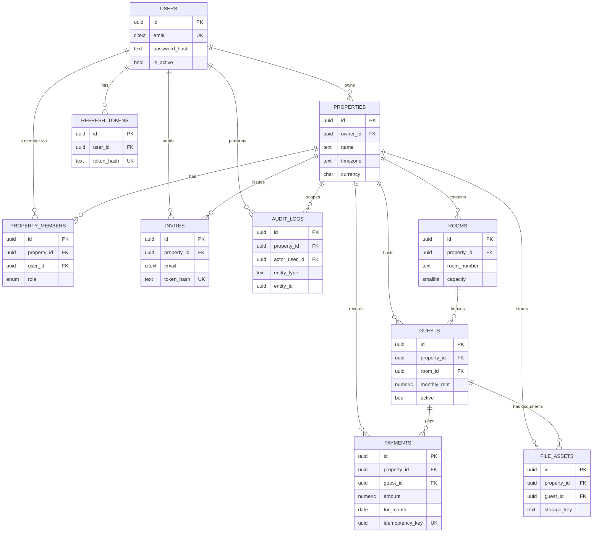

# PG Management SaaS — PostgreSQL Database Architecture

**Scope:** Complete relational schema design for the backend defined in `BACKEND_ARCHITECTURE.md`. Architecture only — no DDL, no ORM code.
**Target scale:** thousands of properties, millions of guest records, tens of millions of payment records.

---

## 0. Scale Reality Check First

Before designing indexes for "millions of guests," it's worth checking whether that number is actually consistent with the business.

A PG (paying-guest) hostel typically runs 20–150 beds. Even at 10,000 properties on the platform — an aggressive, mature-platform assumption, not a launch number — that's roughly 200K–1.5M **currently active** guest rows. "Millions of guests" only becomes real as a **cumulative historical count**: guests move out and get replaced every few months, so five years of platform history across a few thousand properties genuinely does produce millions of guest rows over time, most of them `active = false`.

That distinction matters for the design, not just the pitch deck: it means `guests` is not the biggest table — `payments` is. Each guest generates roughly one payment per month for the duration of their stay. Millions of historical guests × ~6–24 payments each easily means **tens to hundreds of millions of payment rows**. Every partitioning, indexing, and archival decision below is built around `payments` (and `audit_logs`, which grows at a similar or faster rate) being the tables that actually threaten performance — `guests`, `rooms`, and `properties` will be fine on a single well-indexed table for the life of this product.

---

## 1. Naming Conventions

Consistency here isn't cosmetic — at this scale, inconsistent naming is what causes a query to silently join on the wrong column six months from now.

| Element | Convention | Example |
|---|---|---|
| Table names | `snake_case`, plural | `guests`, `payments`, `property_members` |
| Primary key | always `id` | every table |
| Foreign key (unambiguous) | `<singular_referenced_table>_id` | `property_id`, `guest_id`, `room_id` |
| Foreign key (role-qualified, when a table has 2+ FKs to the same target) | `<role>_by` or `<role>_id` | `created_by`, `updated_by`, `recorded_by`, `actor_user_id` (all point to `users.id`, but a plain `user_id` on `payments` would be ambiguous between "who paid" and "who recorded it") |
| Boolean columns | `is_<state>` / `has_<thing>` | `is_active`, `is_ac`, `has_food` — note this fixes the mobile app's inconsistent `food` boolean into a self-describing name |
| Enum types | `<domain>_type` or `<domain>` | `property_role`, `room_type`, `guest_type`, `payment_method`, `food_type` |
| Timestamps | always `_at`, always `timestamptz` | `created_at`, `updated_at`, `deleted_at`, `paid_at`, `expires_at` |
| Dates (no time component) | always `_date` or domain name if unambiguous | `for_month`, `joined_at` → actually a date; see note in §5 |
| Indexes | `ix_<table>__<col1>_<col2>` | `ix_payments__property_id_for_month` |
| Unique constraints | `uq_<table>__<col1>_<col2>` | `uq_rooms__property_id_room_number` |
| Foreign key constraints | `fk_<table>__<col>__<ref_table>` | `fk_guests__room_id__rooms` |
| Check constraints | `ck_<table>__<rule>` | `ck_rooms__capacity_range` |

One deliberate inconsistency to flag rather than hide: `joined_at` and `moved_out_at` read like timestamps but are conceptually dates (a guest "joins" on a calendar day, not a specific second). Store them as `DATE`, not `timestamptz` — the `_at` suffix is kept only for continuity with the mobile app's existing field names, not because it's the ideal name. If this schema is greenfield rather than a migration target, rename them `joined_date` / `moved_out_date` and drop this exception.

---

## 2. UUID Strategy

**Decision: UUIDv7 for every primary key, generated application-side, stored as native Postgres `UUID` (16 bytes).**

This deserves explanation because the obvious choice (UUIDv4) is the wrong one at this scale:

- **UUIDv4 is fully random.** Every insert into a B-tree-indexed primary key lands at a random point in the index. Once `payments` has tens of millions of rows, that means constant page splits, poor buffer-cache hit rates (the "hot" page you just wrote is never the next page you write to), and index bloat that autovacuum fights forever. This is a well-documented Postgres pain point specifically at the volume this product is targeting — it's not a theoretical concern.
- **UUIDv7 embeds a millisecond timestamp in the high bits**, so consecutively generated IDs sort close to each other. Inserts become append-mostly, like a `bigserial`, while still being globally unique without a shared sequence — which matters because there will be multiple API instances (and eventually background workers, and offline-generated mobile IDs syncing in) all minting IDs concurrently. A shared sequence would become a contention point; random UUIDs solve contention but wreck locality; UUIDv7 gets both.
- **Generated application-side, not DB-side**, so a payment or guest record can be assigned its permanent ID the moment it's created — including offline on a mobile client before it's ever synced — without waiting on a round-trip to Postgres. This also means the ID a client generates now is the same ID it'll have forever, which matters if the mobile app ever needs offline-first support later.
- **Native `UUID` type, not `VARCHAR(36)`**: 16 bytes vs. 36+ bytes per value, across a column that appears as a PK in the biggest tables in the system and as an FK in nearly every other table. That difference compounds across every index on every foreign key.
- **Why UUID over `bigserial` at all**, given the locality argument above almost makes the case for `bigserial`: UUIDs don't leak business information (a sequential `payments.id` lets anyone estimate total transaction volume from two consecutive IDs), they don't require a central sequence authority once the system federates, and they let the mobile client and backend use the exact same identifier space — the current app already generates client-side IDs (just badly — see below). UUIDv7 keeps that capability while fixing the ID scheme's actual flaw.
- One thing to explicitly retire: the mobile app's current ID generator (`Date.now() + Math.random()` string) is not collision-safe across two devices generating an ID in the same millisecond, and it's not a UUID at all — it needs to be replaced with a real UUIDv7 generator in the client the moment this backend exists, not just accepted as-is.

---

## 3. Row Ownership & Tenant Isolation Strategy

This is the single most consequential decision in the schema, because a mistake here doesn't cause a bug — it causes one tenant to see another tenant's guests, phone numbers, and government ID data.

**Two layers, deliberately redundant:**

1. **Direct `property_id` on every property-scoped table.** `guests.property_id` and `payments.property_id` are stored directly, not inferred by joining through `rooms`. This is a performance decision as much as a safety one: "list this property's guests" becomes a single indexed equality scan, not a three-table join, and it means tenant-scoping can be enforced identically everywhere with one predicate instead of a different join path per query.
2. **Postgres Row-Level Security (RLS) as a second, independent enforcement layer.** Every property-scoped table gets RLS enabled with a policy of the shape "rows are visible only if `property_id` is in the caller's set of `property_members` rows." The application service layer still does its own authorization check (per `BACKEND_ARCHITECTURE.md` §2.5) — RLS is not a replacement for that, because RLS policies are easy to get subtly wrong and hard to unit-test in isolation. What RLS buys is that **a bug in application authorization code no longer automatically means a cross-tenant data leak** — the database itself refuses to hand back rows outside the caller's properties, even if the API layer forgets to filter. Given this schema stores Aadhaar numbers, that second independent layer is worth the operational overhead of maintaining RLS policies alongside application logic.

**Ownership vs. membership are deliberately separate concepts.** `properties.owner_id` answers "who can delete this property or transfer billing" — a single, authoritative owner. `property_members` (with `role`) answers "who can currently read/write this property's data day to day." An owner is simply the member row with `role = 'owner'`, but the two are modeled separately because a real requirement will show up fast: an owner wants to hand a manager full read/write access without handing over the power to delete the property or change who else has access. Collapsing these into one `role` column on `properties` would make that impossible to express later without a migration.

---

## 4. Entity List & Table Descriptions

### 4.1 `users`
The platform-wide identity table. A user is not scoped to a property — the same person can own or work at multiple properties, which is exactly what "multi-property" requires.

Key fields: `id`, `email` (unique, case-insensitive), `phone` (unique, nullable), `password_hash`, `full_name`, `is_active`, `is_superuser` (rare platform-admin flag, not a property role).

Users are **deactivated, not hard-deleted**, in the normal case (`is_active = false`), because deleting a user who has `payments.recorded_by` or `audit_logs.actor_user_id` rows pointing at them would either cascade-delete financial history or leave dangling references — neither acceptable. A genuine "erase my data" request (compliance-driven) is handled as a separate, deliberate process — not a plain `DELETE`.

### 4.2 `properties`
One row per PG property. Owned by exactly one user (`owner_id`), staffed by zero or more via `property_members`.

Key fields: `id`, `owner_id`, `name`, `address_line`, `city`, `state`, `pincode`, `country`, `timezone` (default `Asia/Kolkata`), `currency` (default `INR`), `is_active`.

### 4.3 `property_members`
The access-control join table between `users` and `properties`. This is where "multi-property, multi-staff" actually lives.

Key fields: `id`, `property_id`, `user_id`, `role` (`owner | manager | staff`), `invited_at`, `accepted_at`, `is_active`. Unique on `(property_id, user_id)` — a user has exactly one role per property, not multiple overlapping memberships.

### 4.4 `rooms`
Physical rooms within a property. Occupancy and "Full/Available" status are **derived at query time from active guests, never stored** — this preserves the one piece of domain logic the current mobile app already gets right, and storing a redundant `occupied_count` column would just create a value that can drift from reality.

Key fields: `id`, `property_id`, `room_number`, `room_type` (enum + `custom_type_label` for the `'custom'` case), `capacity` (1–20), `is_ac`, `advance_details` (numeric — the mobile app currently stores this as free text, which is a data-quality bug worth fixing at the schema level, not carrying forward).

### 4.5 `guests`
The largest "entity" table by row count (though not by storage volume — see §0). One row per guest **per stay**, not per person — if the same individual leaves and returns six months later as a new tenancy, that's a new row, because rent, room, and dates all differ and the payment history needs to attach to a specific stay, not a person.

Key fields: `id`, `property_id` (denormalized, see §3), `room_id`, `full_name`, `phone`, `aadhar_number_encrypted` (encrypted column, never plaintext — see §7), `aadhar_last4` (plaintext, for UI display/search without decrypting the full value), `permanent_address`, `guest_type`, `stay_duration`, `stay_unit`, `monthly_rent`, `advance_paid`, `has_food`, `food_type`, `active`, `joined_at`, `moved_out_at`.

### 4.6 `payments`
The dominant table by volume (§0) and the one every partitioning decision in §9 is built around. One row per rent payment, immutable once written except for soft-delete.

Key fields: `id`, `property_id` (denormalized), `guest_id`, `amount`, `method`, `for_month` (first-of-month `DATE`, not a `'YYYY-MM'` string — real date arithmetic and range queries need a real date type), `paid_at`, `recorded_by`, `idempotency_key`, `notes`.

### 4.7 `file_assets`
Metadata for uploaded files (guest profile pictures, documents). Stores an object-storage key, not a URL — signed URLs are generated at read time so access can be revoked/expired without touching this table.

Key fields: `id`, `property_id`, `guest_id` (nullable — some assets aren't guest-specific), `kind`, `storage_key`, `uploaded_by`.

### 4.8 `refresh_tokens`
Session/device tracking for JWT refresh flow. One row per active login session, not per user — supports multi-device login and per-device revocation.

Key fields: `id`, `user_id`, `token_hash` (never the raw token), `device_info`, `expires_at`, `revoked_at`.

### 4.9 `invites`
Pending staff invitations, before an invited email becomes a `property_members` row.

Key fields: `id`, `property_id`, `email`, `role`, `token_hash`, `invited_by`, `expires_at`, `accepted_at`.

### 4.10 `audit_logs`
Append-only history of who changed what. Grows at a rate comparable to `payments` (every guest edit, payment edit, room change, and member-role change writes a row) and is partitioned the same way.

Key fields: `id` (UUIDv7 — time-ordering is directly useful for an append-only log), `property_id` (nullable for platform-level actions), `actor_user_id`, `action`, `entity_type`, `entity_id`, `diff` (JSONB, before/after), `created_at`.

---

## 5. ER Diagram

(This renders natively on GitHub. `property_id` denormalization onto `guests`, `payments`, and `file_assets` is intentional and explained in §3 — it looks redundant next to the `rooms`/`guests` relationship but it's the load-bearing tenant-isolation decision, not an oversight.)

---

## 6. Foreign Keys & Cascade Rules

Every cascade choice below is a deliberate answer to "what should happen to dependent rows," not a default.

| Table.Column | References | ON DELETE | Why |
|---|---|---|---|
| `properties.owner_id` | `users.id` | `RESTRICT` | A property can never be left ownerless by a user deletion. Ownership must be explicitly transferred before a user account can be removed — this is a forcing function, not an oversight. |
| `properties.created_by` / `updated_by` | `users.id` | `SET NULL` | Audit convenience fields, not structural — losing "who created this" to `NULL` on user deletion is acceptable; blocking property deletion over it is not. |
| `property_members.property_id` | `properties.id` | `CASCADE` | Membership rows are meaningless without the property; deleting a property should clean up its access-control rows. |
| `property_members.user_id` | `users.id` | `CASCADE` | If a user is genuinely removed, their access grants across every property should disappear with them — this is the one place a hard user delete should cascade, since it's pure access control, not a financial or historical record. |
| `rooms.property_id` | `properties.id` | `CASCADE` | Rooms have no meaning outside their property. In practice properties are soft-deleted (see §8) so this cascade rarely fires against real data, but it's correct as a backstop. |
| `guests.property_id` | `properties.id` | `CASCADE` | Same reasoning as rooms. |
| `guests.room_id` | `rooms.id` | `RESTRICT` | This is the important one: a room must **never** be hard-deletable while any guest — active or historical — still references it, because that guest's payment history hangs off `guests.room_id` transitively. The service layer already blocks deleting a room with active guests (per `BACKEND_ARCHITECTURE.md`); this constraint is the database refusing to allow that rule to be bypassed by a direct DB operation, a bad migration, or an admin script. |
| `payments.property_id` | `properties.id` | `CASCADE` | Same as rooms/guests — property deletion is the true root of the cascade tree. |
| `payments.guest_id` | `guests.id` | `RESTRICT` | Payments are financial ledger entries. A guest row must never disappear out from under a payment record — guests are soft-deleted (§8), never hard-deleted, specifically so this constraint never has to be violated. |
| `payments.recorded_by` | `users.id` | `SET NULL` | Who recorded a payment is useful provenance, not structural — don't block a user deletion over it. |
| `file_assets.property_id` | `properties.id` | `CASCADE` | |
| `file_assets.guest_id` | `guests.id` | `CASCADE` | Unlike payments, a guest's photo/documents genuinely have no purpose once the guest row itself is gone — but note guests are soft-deleted, so this cascade is really about the rare hard-delete/GDPR-erasure path, not normal operation. |
| `refresh_tokens.user_id` | `users.id` | `CASCADE` | Sessions are meaningless without the user. |
| `invites.property_id` | `properties.id` | `CASCADE` | |
| `invites.invited_by` | `users.id` | `SET NULL` | |
| `audit_logs.property_id` | `properties.id` | `CASCADE` | Debatable — an argument exists for `RESTRICT` so a property's audit trail survives its deletion for compliance purposes. Given properties are soft-deleted in practice (§8) and never actually hard-removed while under any retention obligation, `CASCADE` is acceptable here; revisit if a hard-delete/right-to-erasure flow is built for properties specifically. |
| `audit_logs.actor_user_id` | `users.id` | `SET NULL` | The action happened regardless of whether the actor's account still exists. |

**General principle used throughout:** `RESTRICT` on any edge where the child row represents money or a historical fact that must never silently vanish (`guests.room_id`, `payments.guest_id`); `CASCADE` on any edge where the child is pure structure/access-control with no independent meaning (`property_members`, `rooms`, `refresh_tokens`); `SET NULL` on any edge that's just provenance metadata (`*_by` columns).

---

## 7. Constraints

Beyond foreign keys, enforced at the database level — not just in application/Pydantic validation, because validation living only in the app means a second write path (an admin tool, a data-fix script, a future microservice) can silently violate an invariant the app was quietly relying on.

| Table | Constraint | Rule |
|---|---|---|
| `rooms` | `ck_rooms__capacity_range` | `capacity BETWEEN 1 AND 20` |
| `rooms` | `uq_rooms__property_id_room_number` | unique on `(property_id, room_number)`, **partial**: `WHERE deleted_at IS NULL` — so a deleted room's number can be reused without a permanent unique-index collision |
| `guests` | `ck_guests__monthly_rent_nonneg` | `monthly_rent >= 0` |
| `guests` | `ck_guests__advance_nonneg` | `advance_paid IS NULL OR advance_paid >= 0` |
| `guests` | `ck_guests__moveout_consistency` | `active = true OR moved_out_at IS NOT NULL` — can't be inactive without a move-out date |
| `guests` | `ck_guests__phone_format` | regex backstop matching the app's validation, so a bad phone can't enter via a non-app write path |
| `payments` | `ck_payments__amount_positive` | `amount > 0` |
| `payments` | `ck_payments__for_month_is_first_of_month` | `date_trunc('month', for_month) = for_month` — enforces the "first-of-month" shape at the DB level instead of trusting every caller to normalize it |
| `payments` | `uq_payments__property_id_idempotency_key` | unique on `(property_id, idempotency_key)` — this is what makes retried payment submissions safe; see `BACKEND_ARCHITECTURE.md` §3.4 |
| `property_members` | `uq_property_members__property_id_user_id` | unique on `(property_id, user_id)` |
| `users` | `uq_users__email` | unique, on a `citext` column (case-insensitive — `Owner@Gmail.com` and `owner@gmail.com` must collide) |
| `refresh_tokens` | `uq_refresh_tokens__token_hash` | unique |
| `invites` | `uq_invites__token_hash` | unique |

---

## 8. Audit Fields

Two distinct mechanisms, both needed, answering different questions:

**Row-level audit columns** (`created_at`, `updated_at`, `created_by`, `updated_by`, `deleted_at`) exist on every business table (`properties`, `rooms`, `guests`, `payments`, `property_members`). They answer *"who last touched this specific row, and when."* `updated_at` is maintained by a database trigger (`BEFORE UPDATE`), not by application code — that way it's still correct even if a row is modified by a migration script, a background job, or a direct psql fix, none of which can be trusted to remember to set it manually. `deleted_at` is the soft-delete marker (see below); `created_by`/`updated_by` are nullable FKs to `users`, null for system-generated rows (seed data, migrations).

**The `audit_logs` table** answers a different question: *"show me the full history of everything that happened to this record."* Row-level columns only ever hold the *last* editor — they can't tell you that three different staff members edited a guest's rent over the past year, or what the value was before each change. For `guests`, `payments`, and `property_members` specifically — the tables carrying money and PII — that history isn't optional. Every service-layer write to those tables writes a corresponding `audit_logs` row with a JSONB before/after diff. This is what makes "who changed this guest's Aadhaar number, and to what" an answerable question instead of a shrug, which matters given the compliance exposure already flagged in `BACKEND_ARCHITECTURE.md` §3.

**Soft delete, not hard delete, is the default** for `properties`, `rooms`, `guests`, and `property_members` — the reasoning is repeated at each relevant point above: financial and historical records must survive the "deletion" of things they reference. `deleted_at IS NULL` is the standard "is this row live" predicate, and every index that needs to reflect "current" state (like the room-number uniqueness constraint) is a **partial index** filtered on it, rather than a full-table index that would need extra `WHERE deleted_at IS NULL` clauses added correctly by every single caller forever.

---

## 9. Composite Indexes

Indexes are listed with the query pattern that justifies them — an index with no query behind it is just write-amplification and disk space.

| Table | Index | Query it serves |
|---|---|---|
| `guests` | `(property_id, active)` | Dashboard "active guest count," guest list default filter |
| `guests` | `(property_id, room_id)` | Occupancy computation per room (derived, not stored — see §4.4) |
| `guests` | `(property_id, phone)` | Duplicate-phone lookup **within a property** — deliberately not a global unique index, since two unrelated properties may legitimately have guests sharing a family phone number |
| `rooms` | `(property_id, room_number) WHERE deleted_at IS NULL` | Unique constraint + the "does this room number already exist" check on every room creation (see §7) |
| `payments` | `(property_id, for_month)` | Monthly reconciliation, dashboard "pending rent this month" — the highest-frequency query in the whole system |
| `payments` | `(guest_id, for_month)` | Per-guest balance lookup — on the hot path of every "record payment" write (must know current balance before accepting a new payment) and the guest detail screen |
| `payments` | `(property_id, paid_at)` | Reports/collections range queries; becomes a **local** index per partition once partitioning (§10) is in place, which is exactly where it needs to be cheap |
| `property_members` | `(user_id, is_active)` | "List my properties" — the reverse-direction lookup from every `property_id`-keyed index above |
| `audit_logs` | `(property_id, created_at)` | Property activity feed |
| `audit_logs` | `(entity_type, entity_id, created_at)` | "Show me the history of this specific record" |
| `refresh_tokens` | `(user_id, revoked_at)` | "List active sessions for this user" |
| `refresh_tokens` | `(expires_at)` | Background cleanup job for expired tokens |

Every index above leads with `property_id` (or `user_id`/`guest_id` for the reverse-direction cases) precisely because every real query in this system is scoped to a tenant or a specific entity — there is no query pattern that needs a global unfiltered scan across all properties, so no index needs to support one.

---

## 10. Future Scalability

**Partitioning — `payments` and `audit_logs` only.** These are the two tables that grow unbounded and fastest (§0). Both are partitioned by `RANGE` on their timestamp column (`paid_at`, `created_at`) in monthly partitions, managed with `pg_partman` rather than hand-rolled partition-maintenance scripts. Monthly range partitioning is chosen over hashing on `property_id` because the dominant query patterns (§9) are time-scoped — "this month's payments," "collections from date X to Y" — so partition pruning does real work on the queries that actually run. A large property with years of history pays a small cost (its payments span many partitions), but that's a much smaller problem than the alternative of every query touching one giant, ever-growing table with no pruning at all. If a future customer becomes large enough that hashing by `property_id` within each monthly partition becomes worthwhile, that's a sub-partitioning addition, not a redesign.

**Old partition handling**: once a monthly `payments` partition is old enough that it's rarely queried (e.g. >24 months), it can be moved to a cheaper tablespace, or detached and archived to object storage if the product's data-retention policy allows it — this is a lever this design makes available, not a decision this document is making on the business's behalf.

**Sharding readiness.** Because every property-scoped table already carries `property_id` directly (§3) rather than requiring a join to determine tenancy, `property_id` is a ready-made shard key if this ever needs to move to a distributed Postgres setup (Citus, or manual sharding by property range). This wasn't originally added for that reason — it was added for tenant-isolation query performance — but it's a real payoff of that decision worth naming.

**Read replicas.** Dashboard and reporting queries (`stats/dashboard`, `reports/collections`) are read-heavy and tolerate slight staleness. Once write volume on the primary grows enough to matter, those endpoints are the first candidates to move to a read replica, without any schema change — this is an infrastructure decision the schema doesn't need to anticipate further than "don't do anything that makes replication hard" (e.g. avoid triggers with side effects outside the database).

**Connection pooling.** At thousands of properties with concurrent staff access, application-server connection counts will exceed what Postgres handles well directly — PgBouncer (transaction-pooling mode) sits between the API layer and Postgres from day one, not bolted on later, since retrofitting pooling mode after the app has assumed session-level features (e.g. advisory locks, prepared statements) is more painful than starting with it.

**Extension point for custom fields.** Rather than adding speculative nullable columns for hypothetical future PG-specific fields, `properties` and `guests` each get a single `metadata JSONB` column (default `'{}'`) as a pressure-release valve for fields that don't yet justify a migration. This is a deliberate trade-off — JSONB fields aren't type-checked or cheaply indexable the way real columns are — so the rule is: **anything queried or filtered on graduates to a real column**; `metadata` is only for display-only, rarely-queried attributes. A GIN index is added to it only if and when a real query against it shows up; not preemptively.

---

## 11. Summary of Deliberate Trade-offs

Worth stating plainly rather than burying in the sections above, since these are the calls most likely to be revisited later:

- **UUIDv7 over `bigserial`**: chosen for offline-ID generation and non-enumerable IDs, at the cost of 16 bytes vs. 8 bytes per key — accepted because the alternative (serial IDs) can't be safely generated client-side.
- **`property_id` denormalized onto `guests`, `payments`, `file_assets`, `audit_logs`** even though it's derivable via `room_id`/`guest_id` joins — chosen for tenant-isolation query performance and RLS simplicity, at the cost of needing consistency enforcement (a guest's `property_id` must always match its `room.property_id`) — enforce this with a trigger or a service-layer invariant, since a plain FK can't express "these two columns must agree."
- **Soft delete as default, hard delete as the exception** — chosen because financial and historical integrity outweighs storage cost, at the cost of every query needing to remember the `deleted_at IS NULL` predicate (mitigated by partial indexes and, ideally, Postgres views or the ORM's default scope always applying it).
- **RLS as a second enforcement layer on top of application authorization** — chosen because the data includes government ID numbers and the cost of a cross-tenant leak is severe, at the cost of maintaining two authorization implementations that must stay in sync.
