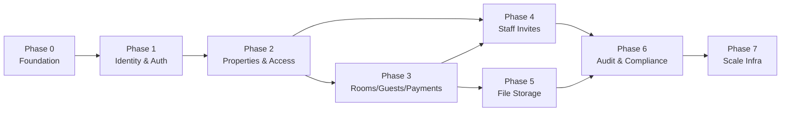

# PG Management SaaS — Backend Implementation Milestones

**Source documents:** `BACKEND_ARCHITECTURE.md`, `DB_ARCHITECTURE.md`
**Rule applied:** every milestone is independently buildable and verifiable on its own, ordered strictly by dependency, sized 1–3 hours.

## Reality check on the sizing constraint

55 milestones came out of this breakdown, summing to **~90 hours** of focused implementation for the full scope (Phases 0–7 below — MVP through compliance hardening and scale infra). Four of them are flagged ⚠ because "1–3 hours" is optimistic for what they actually involve once you include real tests, not just the happy path:

- **6.4 Aadhaar encryption** — fine at 2.5h *only* if you're using a single symmetric key from env/secrets manager. The moment key rotation or a real KMS enters the picture, this is its own multi-day project.
- **6.5 Row-Level Security policies** — the estimate assumes you write negative tests (prove tenant A genuinely cannot read tenant B's rows). Skip those tests and you'll hit the 3h estimate; include them, which you should given what's stored here, and it commonly runs long the first time you debug a policy that silently returns zero rows for the *wrong* reason.
- **7.5 Payments partitioning via pg_partman** — first-time partition setup plus confirming partition pruning actually kicks in against the composite indexes from `DB_ARCHITECTURE.md` §9 is a real afternoon, not an hour block.

If you're staffing this as a solo effort, budget closer to **3 focused weeks**, not "a bunch of 2-hour tasks I can knock out around other things" — the dependency chain means most of these can't be parallelized by one person anyway.

**Phases 0–3 are the MVP cutoff** (matches `BACKEND_ARCHITECTURE.md` §4 Phase 1: single property per user, online-only, feature parity with the current mobile app) — that's 57.5h across 37 milestones. Phases 4–7 add multi-property staff collaboration, file storage, compliance hardening, and scale infra, matching Phases 2–4 in that same rollout plan.

---

## Phase 0 — Foundation

No business logic yet. Everything downstream depends on this existing and working.

| ID | Milestone | Depends on | Est. |
|---|---|---|---|
| 0.1 | Project scaffolding & config | — | 2h |
| 0.2 | Docker Compose (api + postgres + redis) | 0.1 | 1.5h |
| 0.3 | Async DB session + Alembic init | 0.2 | 1.5h |
| 0.4 | Base model conventions (mixins, naming, `updated_at` trigger fn) | 0.3 | 2h |
| 0.5 | Test infrastructure (pytest-asyncio + test DB) | 0.3 | 2h |
| 0.6 | Auth core utilities (password hashing, JWT encode/decode) | 0.1 | 1.5h |

**0.1 — Project scaffolding & config**
- `app/` folder structure matches `BACKEND_ARCHITECTURE.md` §2.7 exactly (`core/`, `db/`, `models/`, `schemas/`, `repositories/`, `services/`, `api/v1/`)
- `pydantic-settings`-based config loads from `.env`, with typed fields for DB URL, JWT secret, Redis URL
- `GET /health` returns `200` with no DB dependency
- `uvicorn app.main:app` boots with zero errors on a clean checkout

**0.2 — Docker Compose (api + postgres + redis)**
- `docker-compose up` starts all three services and the API container can reach both `postgres` and `redis` by service name
- Postgres data persists across `docker-compose down && up` (named volume, not ephemeral)
- `.env.example` documents every variable Compose expects

**0.3 — Async DB session + Alembic init**
- `alembic upgrade head` on an empty database succeeds with zero migrations (baseline only)
- A FastAPI dependency (`get_db`) yields an `AsyncSession` and is used in at least one throwaway test endpoint that queries `SELECT 1`
- Async engine uses connection pooling settings appropriate for a containerized deploy (pool size explicit, not default)

**0.4 — Base model conventions**
- Declarative base with a Postgres-specific naming convention for constraints (matches `DB_ARCHITECTURE.md` §1: `ix_`, `uq_`, `fk_`, `ck_` prefixes) — verified by generating one throwaway migration and inspecting the constraint names it produces
- Reusable mixins exist for `id` (UUID, server default not required since IDs are app-generated per §2), `created_at`/`updated_at`, and `deleted_at`
- `set_updated_at()` trigger function is created via migration and unit-tested by updating a throwaway row and confirming `updated_at` changes without the app setting it

**0.5 — Test infrastructure**
- `pytest` runs against a real, isolated test Postgres database (testcontainers or a dedicated `docker-compose.test.yml` service), not a mocked DB
- Each test runs inside a transaction that's rolled back after — verified by running the same test twice in a row with no state bleed
- CI config (or a documented local command) runs the full suite in under 60 seconds with zero tests

**0.6 — Auth core utilities**
- `hash_password` / `verify_password` round-trip correctly; verified against a known bad password returning `False`
- `create_access_token` / `decode_token` round-trip a `user_id` claim and correctly reject an expired or tampered token
- Unit tests cover: valid token, expired token, tampered signature, missing claim

---

## Phase 1 — Identity & Auth

| ID | Milestone | Depends on | Est. |
|---|---|---|---|
| 1.1 | `users` table + migration | 0.4 | 1h |
| 1.2 | `refresh_tokens` table + migration | 0.4 | 1h |
| 1.3 | User repository | 1.1 | 1h |
| 1.4 | Auth service (register/login/refresh/logout logic) | 1.3, 1.2, 0.6 | 2h |
| 1.5 | Register + Login endpoints | 1.4 | 2h |
| 1.6 | Refresh + Logout endpoints | 1.4 | 1.5h |
| 1.7 | `get_current_user` dependency + `GET /auth/me` | 1.5 | 1h |
| 1.8 | Auth rate limiting (`slowapi` + Redis) | 1.5, 0.2 | 1.5h |

**1.1 — `users` table + migration**
- Migration matches `DB_ARCHITECTURE.md` §4.1 exactly: `citext` email unique, phone unique nullable, `is_active`, `is_superuser`
- `citext` extension enabled; inserting `Test@x.com` then `test@x.com` raises a unique-violation
- `alembic downgrade -1` cleanly drops the table

**1.2 — `refresh_tokens` table + migration**
- FK to `users.id` with `ON DELETE CASCADE` (per `DB_ARCHITECTURE.md` §6)
- `token_hash` has a unique constraint
- Index on `(user_id, revoked_at)` and `(expires_at)` present, confirmed via `\d refresh_tokens`

**1.3 — User repository**
- Methods: `get_by_id`, `get_by_email`, `create` — no business logic, no password hashing inside the repository
- Integration test creates a user via the repository and fetches it back by email with different casing, confirming case-insensitive lookup

**1.4 — Auth service**
- `register()` rejects a duplicate email with a domain-specific exception (not a raw DB error leaking to the caller)
- `login()` returns an access + refresh token pair on valid credentials, raises on invalid password without revealing whether the email exists (timing-safe enough to not trivially enumerate accounts)
- `refresh()` rotates the token: old refresh token is marked revoked, new one issued — verified by attempting to reuse the old token and getting rejected
- Unit tests use a fake/mock repository, no real DB required

**1.5 — Register + Login endpoints**
- `POST /auth/register` returns `201` with no password field in the response body
- `POST /auth/login` returns `200` with access + refresh tokens on success, `401` on bad credentials
- OpenAPI schema at `/docs` reflects both endpoints correctly

**1.6 — Refresh + Logout endpoints**
- `POST /auth/refresh` returns a new token pair; the previous refresh token is unusable afterward (integration test proves this)
- `POST /auth/logout` revokes the given refresh token; a subsequent refresh attempt with it returns `401`

**1.7 — `get_current_user` + `/auth/me`**
- Dependency rejects missing, expired, and malformed tokens with `401`, and rejects a valid token for a now-`is_active=false` user
- `GET /auth/me` returns the authenticated user's profile, no other user's data reachable via this endpoint

**1.8 — Auth rate limiting**
- `/auth/login` and `/auth/register` are limited (e.g. 5 requests/minute/IP) backed by Redis
- Integration test hits the limit and confirms a `429` response
- Limit does not apply to unrelated endpoints (verified by hitting `/health` past the same threshold with no effect)

---

## Phase 2 — Properties & Access Control

| ID | Milestone | Depends on | Est. |
|---|---|---|---|
| 2.1 | `properties` table + migration | 1.1 | 1h |
| 2.2 | `property_members` table + migration | 2.1 | 1h |
| 2.3 | Property repository | 2.1 | 1h |
| 2.4 | Property service (create auto-adds owner as member) | 2.3, 2.2 | 1.5h |
| 2.5 | Create + List properties endpoints | 2.4, 1.7 | 1.5h |
| 2.6 | Get/Patch/Delete property endpoints | 2.5 | 1.5h |
| 2.7 | `require_property_member` / `require_role` dependency | 2.2, 1.7 | 2h |
| 2.8 | Property member list/role-change/revoke endpoints | 2.7 | 2h |

**2.1 — `properties` table + migration**
- FK `owner_id → users.id` with `ON DELETE RESTRICT` — integration test attempts to delete a user who owns a property and confirms it's blocked
- Defaults present: `timezone = 'Asia/Kolkata'`, `currency = 'INR'`

**2.2 — `property_members` table + migration**
- FK `property_id → properties.id ON DELETE CASCADE`, FK `user_id → users.id ON DELETE CASCADE` (per §6 reasoning)
- `role` enum matches (`owner`, `manager`, `staff`); unique constraint on `(property_id, user_id)` verified by attempting a duplicate insert

**2.3 — Property repository**
- Methods: `create`, `get_by_id`, `list_for_user` (joins through `property_members`) — no authorization logic here, that's Phase 2.7's job

**2.4 — Property service**
- Creating a property in one call produces both the `properties` row and a `property_members` row with `role='owner'` for the creator — verified atomically (both succeed or both roll back on simulated failure)

**2.5 — Create + List properties endpoints**
- `POST /properties` requires auth, returns `201`
- `GET /properties` returns only properties the authenticated user belongs to — integration test creates two users with separate properties and confirms no cross-visibility

**2.6 — Get/Patch/Delete property endpoints**
- All three reject non-members with `403` (temporarily via a simple ownership check — full role granularity lands in 2.7)
- `DELETE` is a soft delete (`deleted_at` set, row still present) — confirmed by querying directly after the call

**2.7 — `require_property_member` / `require_role` dependency**
- Given `(current_user, property_id)`, resolves the caller's role or raises `403` — used as a FastAPI dependency, not duplicated logic per router
- `require_role('manager')` allows `owner` and `manager`, rejects `staff` — table-driven test covering all three roles against all three minimum-role thresholds
- This is the tenant-isolation boundary named as the top risk in `BACKEND_ARCHITECTURE.md` §3 — test suite explicitly includes a "user from property A cannot access property B" case, not just role-within-property cases

**2.8 — Property member list/role-change/revoke endpoints**
- `GET /properties/{id}/members` visible to any member, `PATCH .../{user_id}` (role change) and `DELETE .../{user_id}` (revoke) restricted to `owner`/`manager`
- A `staff` member attempting a role change on another member gets `403`
- Cannot revoke or demote the last remaining `owner` of a property (integration test confirms the guard)

---

## Phase 3 — Core Domain: Rooms, Guests, Payments

| ID | Milestone | Depends on | Est. |
|---|---|---|---|
| 3.1 | `rooms` table + migration | 2.1 | 1h |
| 3.2 | Room repository | 3.1 | 1h |
| 3.3 | Room service (capacity + uniqueness rules) | 3.2 | 1.5h |
| 3.4 | Room CRUD endpoints | 3.3, 2.7 | 2h |
| 3.5 | `guests` table + migration | 3.1 | 1.5h |
| 3.6 | Guest repository | 3.5 | 1.5h |
| 3.7 | Guest service (occupancy validation, ported from `rent.js`) | 3.6, 3.3 | 2.5h |
| 3.8 | Guest CRUD endpoints | 3.7, 2.7 | 2.5h |
| 3.9 | Guest move-out/reactivate endpoints | 3.8 | 1.5h |
| 3.10 | `payments` table + migration | 3.5 | 1h |
| 3.11 | Payment repository | 3.10 | 1h |
| 3.12 | Payment service (balance calc + idempotency) | 3.11, 3.7 | 2h |
| 3.13 | Payment endpoints | 3.12, 2.7 | 2h |
| 3.14 | Dashboard stats service (`computeStats` port) | 3.7, 3.12 | 2h |
| 3.15 | Dashboard endpoint | 3.14 | 1h |

**3.1 — `rooms` table + migration**
- `CHECK (capacity BETWEEN 1 AND 20)` present and tested with a boundary value on each side (0, 1, 20, 21)
- Partial unique index `(property_id, room_number) WHERE deleted_at IS NULL` — test confirms a deleted room's number can be reused, an active one's can't

**3.2 — Room repository**
- Methods: `create`, `get_by_id`, `list_by_property`, `update`, `soft_delete` — no capacity logic here

**3.3 — Room service**
- Rejects a duplicate room number within a property with a domain exception, not a raw constraint-violation leak
- Rejects deleting a room that has any guest (active or historical) referencing it, matching the `RESTRICT` FK from `DB_ARCHITECTURE.md` §6

**3.4 — Room CRUD endpoints**
- All routes property-scoped via 2.7's dependency; `staff` role can create/edit rooms, matches the mobile app's current implicit single-user permissions
- List endpoint returns each room with **derived** occupancy/status computed at request time, not a stored column (per §4.4 — no drift possible)

**3.5 — `guests` table + migration**
- All enums (`guest_type`, `stay_unit`, `food_type`) match `DB_ARCHITECTURE.md` §4.5; `aadhar_number_encrypted` column exists as `bytea` but is written as plaintext-in-a-bytea-cast for now (real encryption lands in 6.4 — this milestone only needs the column shape right)
- `CHECK` constraints present: `monthly_rent >= 0`, move-out consistency (`active = true OR moved_out_at IS NOT NULL`)

**3.6 — Guest repository**
- Methods: `create`, `get_by_id`, `list_by_property` (with `active`/`room_id`/search filters), `update`, `soft_delete`

**3.7 — Guest service**
- Porting `bedsFreeOf`/`occupancyOf` logic from the mobile app's `rent.js`: rejects adding a guest to a full room, rejects moving a guest into a full room, allows moving within the same room with no change
- Room-capacity check and guest-creation happen as one atomic unit (no race where two concurrent requests both see one free bed and both succeed) — this needs either a row lock on the room or a re-check inside the same transaction; test with two concurrent requests against the last free bed and confirm exactly one succeeds
- Unit tests cover every validation branch already present in the mobile app's `addGuest`/`updateGuest`/`setGuestActive` (phone format, non-negative rent, room-full checks)

**3.8 — Guest CRUD endpoints**
- Property-scoped via 2.7; list endpoint supports `active`, `room_id`, `search` query params matching `BACKEND_ARCHITECTURE.md` §2.6
- Response schema never includes the raw `aadhar_number_encrypted` value, only a masked/last-4 representation

**3.9 — Guest move-out/reactivate endpoints**
- Move-out sets `active=false`, `moved_out_at=now()`, frees the bed (observable via the room list endpoint's derived occupancy)
- Reactivate re-validates bed availability and rejects if the original room is now full, matching the mobile app's `setGuestActive` behavior

**3.10 — `payments` table + migration**
- `CHECK (amount > 0)`, `CHECK (date_trunc('month', for_month) = for_month)`, unique `(property_id, idempotency_key)` all present and each individually tested with a violating insert

**3.11 — Payment repository**
- Methods: `create`, `get_by_id`, `list_by_property` (filterable by `guest_id`/`for_month`), `soft_delete` — no balance math here

**3.12 — Payment service**
- Recording a payment without an idempotency key, or retrying the same key twice, produces exactly one payment row — integration test submits the same request twice and confirms a single row plus a clean "already recorded" response on the second call, not a duplicate charge
- Balance calculation (`paidForMonth`/`balanceForMonth` port) matches the mobile app's reconciliation invariant: pending + collected always equals expected rent for the guests under test

**3.13 — Payment endpoints**
- `POST /properties/{id}/payments` requires the idempotency key; `DELETE` is a soft delete and writes nothing to `audit_logs` yet (that's Phase 6) but is structured so it can
- `GET .../payments?month=&guest_id=` filters correctly, verified against a seeded set spanning multiple months and guests

**3.14 — Dashboard stats service**
- Reproduces `computeStats` exactly: `pendingRent`, `collectedThisMonth`, `totalCollected`, `occupancyRate`, `dueGuests` sorted by balance descending — unit test replicates a fixture from the mobile app's own test data if available, otherwise a hand-built scenario with known expected output
- Verified against a property with zero rooms/guests (no divide-by-zero on occupancy rate)

**3.15 — Dashboard endpoint**
- `GET /properties/{id}/stats/dashboard?month=` returns the service output, defaults `month` to the current month when omitted

---

## Phase 4 — Staff Collaboration (Invites)

| ID | Milestone | Depends on | Est. |
|---|---|---|---|
| 4.1 | `invites` table + migration | 2.2 | 1h |
| 4.2 | Invite service (create + token expiry) | 4.1 | 1.5h |
| 4.3 | Create-invite + list-invites endpoints | 4.2, 2.7 | 1.5h |
| 4.4 | Accept-invite endpoint | 4.3 | 1.5h |

**4.1 — `invites` table + migration**
- FK `property_id → properties.id ON DELETE CASCADE`, unique `token_hash`, `expires_at` present

**4.2 — Invite service**
- Generates a random token, stores only its hash, sets a sane default expiry (e.g. 7 days)
- Rejects creating a duplicate pending invite for the same email on the same property

**4.3 — Create-invite + list-invites endpoints**
- Only `owner`/`manager` can create invites (via 2.7); `staff` gets `403`
- List endpoint shows pending invites with expiry, not the raw token

**4.4 — Accept-invite endpoint**
- Valid, unexpired token creates a `property_members` row with the invited role and marks the invite accepted
- Expired or already-accepted token returns a clear `4xx`, not a generic error
- Accepting requires the invited email to match the authenticated user's email (can't accept someone else's invite by guessing a token meant for a different address)

---

## Phase 5 — File Storage

| ID | Milestone | Depends on | Est. |
|---|---|---|---|
| 5.1 | `file_assets` table + migration | 3.5 | 1h |
| 5.2 | MinIO/S3 client + presigned URL utility | 0.2 | 2h |
| 5.3 | Guest photo upload endpoint | 5.1, 5.2, 3.8 | 2h |

**5.1 — `file_assets` table + migration**
- FK `guest_id → guests.id ON DELETE CASCADE`, `kind` enum present, `storage_key` not nullable

**5.2 — MinIO/S3 client + presigned URL utility**
- MinIO added to `docker-compose.yml` for local/dev parity
- Utility generates a time-limited presigned PUT URL and, separately, a presigned GET URL — both tested against the local MinIO instance with an actual upload/download round-trip, not mocked

**5.3 — Guest photo upload endpoint**
- Endpoint returns a presigned upload URL plus the `file_assets` row it pre-created; a follow-up confirm step (or a storage webhook, if in scope) marks it usable
- Old profile picture reference is superseded, not silently duplicated, on re-upload

---

## Phase 6 — Audit & Compliance

| ID | Milestone | Depends on | Est. |
|---|---|---|---|
| 6.1 | `audit_logs` table + migration (unpartitioned) | 0.4 | 1h |
| 6.2 | Audit-log write helper | 6.1 | 1.5h |
| 6.3 | Wire audit logging into guest/payment/member mutations | 6.2, 3.7, 3.12, 2.8 | 2h |
| 6.4 | Aadhaar encryption at rest ⚠ | 3.5 | 2.5h |
| 6.5 | Row-Level Security policies ⚠ | 2.1, 3.1, 3.5, 3.10 | 3h |

**6.1 — `audit_logs` table + migration**
- `property_id` nullable (platform-level actions), `actor_user_id` FK `ON DELETE SET NULL`, `diff` as `jsonb`
- Composite indexes `(property_id, created_at)` and `(entity_type, entity_id, created_at)` present per `DB_ARCHITECTURE.md` §9

**6.2 — Audit-log write helper**
- Single reusable service-layer function `record_audit(actor, property_id, action, entity_type, entity_id, before, after)` computing the diff — no service should hand-roll its own audit insert
- Unit test confirms the diff correctly captures only changed fields, not the entire before/after object

**6.3 — Wire audit logging into guest/payment/member mutations**
- Every create/update/delete on `guests`, `payments`, and `property_members` writes a corresponding audit row in the same transaction as the mutation — verified by forcing a failure after the mutation and confirming the audit row rolls back too (no orphaned audit entries for failed writes, and no successful writes with a missing audit entry)
- `GET /properties/{id}/audit` (or equivalent) — if not already speced as an endpoint, this milestone adds the minimal read path needed to verify the above in an integration test, even if the full UI-facing endpoint is deferred

**6.4 — Aadhaar encryption at rest ⚠**
- `aadhar_number_encrypted` is genuinely encrypted (pgcrypto `pgp_sym_encrypt` or application-layer AES-GCM with a key from env/secrets manager — pick one, this milestone doesn't require both)
- Decryption is only reachable through a service method gated by role (`manager`+, not `staff`) — verified by a test asserting a `staff`-role request never receives the decrypted value even via a direct service call bypass attempt
- `aadhar_last4` is derived and stored in plaintext for display, confirmed to never require decrypting the full value

**6.5 — Row-Level Security policies ⚠**
- RLS enabled on `rooms`, `guests`, `payments`, `properties`, `property_members`; policies check membership via `property_members` against a session-set `app.current_user_id`
- Negative test: a raw query executed as an authenticated-but-non-member session against another property's `guests` table returns zero rows, not an error and not the data
- Application-layer authorization (2.7) still runs — this milestone proves RLS catches a case where 2.7 is *bypassed entirely* (e.g. a raw query run outside the normal service path), demonstrating the two layers are genuinely independent

---

## Phase 7 — Scale Infrastructure (post-MVP)

| ID | Milestone | Depends on | Est. |
|---|---|---|---|
| 7.1 | Structured logging + request-id middleware | 0.1 | 1.5h |
| 7.2 | CORS + security headers + global exception handler | 0.1 | 1.5h |
| 7.3 | Celery + Redis worker/beat skeleton | 0.2 | 2h |
| 7.4 | Rent-due reminder scheduled job | 7.3, 3.14 | 2h |
| 7.5 | `payments` monthly partitioning via `pg_partman` ⚠ | 3.10 | 3h |
| 7.6 | `audit_logs` monthly partitioning | 6.1, 7.5 | 1.5h |

**7.1 — Structured logging + request-id middleware**
- Every log line is JSON-structured with a request-id that's consistent across all log statements within one request, and returned in a response header for client-side bug reports to reference

**7.2 — CORS + security headers + global exception handler**
- CORS restricted to known origins, not `*`, in any non-local environment
- Unhandled exceptions never leak a stack trace to the client; they return a consistent error shape and log the full detail server-side

**7.3 — Celery + Redis worker/beat skeleton**
- A trivial scheduled task (e.g. log a heartbeat) runs on schedule and is visible in worker logs — proves the beat/worker/broker wiring works before any real job is built on top of it

**7.4 — Rent-due reminder scheduled job**
- Runs daily, identifies guests with `balanceForMonth > 0` for the current month, and produces a notification record/log per guest (actual push-notification delivery is out of scope unless a provider is already chosen — this milestone's acceptance criterion is "the right guests are identified," not "a push notification arrives on a phone")
- Idempotent across multiple runs in the same day (doesn't re-notify for the same guest/month combination twice)

**7.5 — `payments` monthly partitioning via `pg_partman` ⚠**
- Existing `payments` data is migrated into a partitioned table with zero data loss (row count before == row count after, verified by count query, not spot-check)
- `pg_partman` is configured to auto-create future monthly partitions ahead of need
- A query filtered by `paid_at` range shows partition pruning in `EXPLAIN` output — this is the actual proof the migration achieved its purpose, not just "the migration ran without erroring"

**7.6 — `audit_logs` monthly partitioning**
- Same approach as 7.5, applied to `audit_logs` — expected to be faster since the pattern and tooling are already proven
